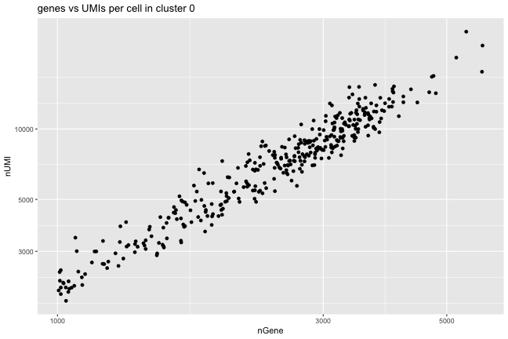

# Exercise 0

## Load the data


```r
load(url("https://github.com/scgenomics/introScRNAseqDataAnalysis.github.io/blob/main/docs/self-assess/self-assessment.rda?raw=true"))

ls() # Let's see what is there
```

```
## [1] "meta.data"
```

The `load()` statement retrieves an
object called `meta.data`, which is a `data.frame` containing
cell-specific data. Rows are cells; columns are various characteristics.

## Exercise 1

How many cells and how many characteristics are there?


```r
dim(meta.data)
```

```
## [1] 1200    5
```

```r
## or
nrow(meta.data)
```

```
## [1] 1200
```

```r
ncol(meta.data)
```

```
## [1] 5
```

## Exercise 2

Column `celltypes` contains the inferred cell type of each cell. How
many cells have type 'Unknown'?


```r
sum(meta.data$celltypes=="Unknown")
```

```
## [1] 43
```

##  Exercise 3

What is the most commonly occurring type, and how many are there? (Hint:
use the `table()` function)


```r
sort(decreasing=TRUE,table(meta.data$celltypes))[1]
```

```
## Macrophage 
##        799
```
##  Exercise 4

Create a plot number of transcripts (column `nUMI` versus numbers of
genes (column `nGene`) of only the cells in cluster `0` (column
`seurat_clusters`)


```r
## We give two solutions, one using base graphics, one using ggplot2:
##
## using base graphics:
cluster <- 0 # this makes a bit more general
data <- meta.data[ meta.data$seurat_clusters==cluster, ]

## There are various other ways of course:
## data <- subset(meta.data, seurat_clusters==cluster)
##   or
## library(dplyr)
## data <- filter(meta.data, seurat_clusters==cluster)

plot(x=data$nGene, y=data$nUMI, log='xy', # using logarithmic axes here
     main=paste0('genes vs UMIs per cell in cluster ', cluster),
     xlab='number of genes',
     ylab='number of UMIs')

## using ggplot2:

library(ggplot2)
```


```r
ggplot(data = data, aes(x = nGene, y = nUMI)) +
  geom_point() +  scale_x_log10() +  scale_y_log10() + 
  labs(title = paste0('genes vs UMIs per cell in cluster ', cluster))
```




### [Back to main](../course.md)
